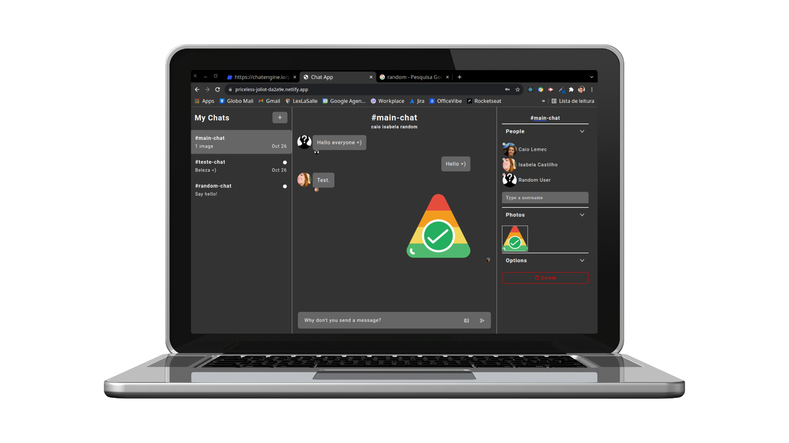

<h1 align="center">
    Chat App 💬
</h1>
<br>
<p align="center">
  <a href="#desktop_computer-project"></a>&nbsp;
  <a href="#nail_care-layout"></a>&nbsp;
  <a href="#technologist-technologies"></a>
  <a href="#octocat-environment"></a>&nbsp;
  <a href="#bookmark_tabs-license"></a>&nbsp;
</p>
<p align="center">
 
</p>

<br>
<hr>

## :desktop_computer: Project

<strong>Chat App</strong> it is a simple web tool for chatting in real time! 🤭

In this application it was possible to deepen knowledge in front-end development, reviewing concepts like: 

- React-Components,
- React-Props,
- React-Hooks,
- Immutability,
- ChatEngine lib,
- Axios,
- much more ...

<br>

## :nail_care: Layout
<p align="center">

</p>
<br>
<hr>

## :technologist: Technologies

- [React](https://pt-br.reactjs.org/)
- [Chat Engine](https://chatengine.io/)

<br>
<hr>

## :octocat: Environment

Keep in mind that the following installations will be needed:

- [Git](https://git-scm.com/book/pt-br/v2/Come%C3%A7ando-Instalando-o-Git)
- [Yarn](https://classic.yarnpkg.com/en/docs/install/#debian-stable)

>`Alert 1:` Due to some features in the styling, it is not recommended to use IE 6-8 as a browser when using this application. <br>

Follow the instructions to run the application:

1. Clone the repository: 
```bash 
git@github.com:CaioLemec/chat_app.git
```
2. Install all dependencies by using command:
```bash
 yarn
 ```
3. At your terminal set this command line to get <strong>dev</strong> mode running:
```bash
yarn start
```
4. Access the generated address in your browser:
```bash
http://localhost:3000/
```
5. Usernames & Passwords:
```bash
caio // 123456
isabela // 123456
random // 111111
```
<hr>

## :bookmark_tabs: License

Licensed under MIT [LICENSE](./LICENSE.md).

<hr>

I am available for any clarification. 
    

<h3>Caio Lemec<h3>
<a href="https://t.me/caiolemec">
<a href="mailto:caiolemec@gmail.com">
<a href="https://www.linkedin.com/in/caiolemec/">
<br>
</p>
